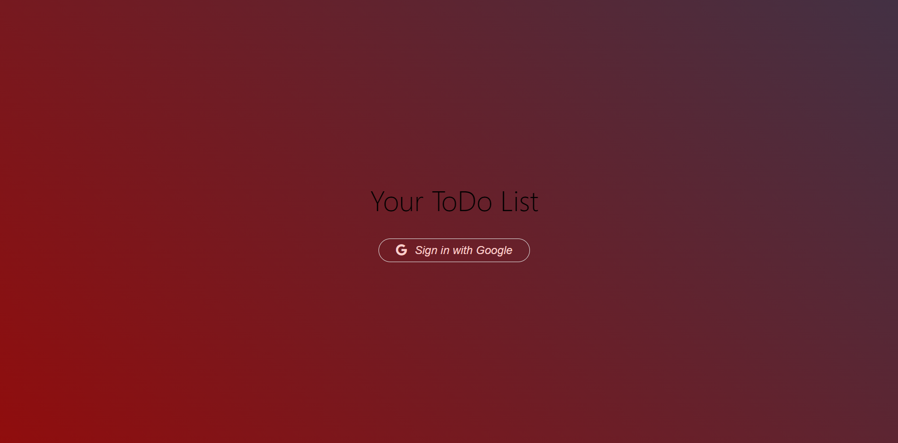
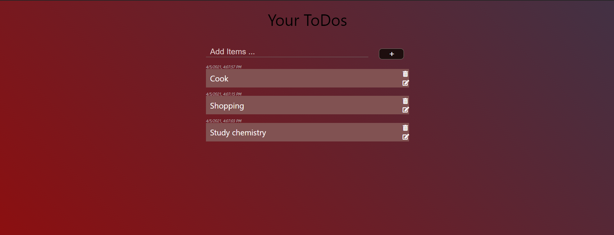
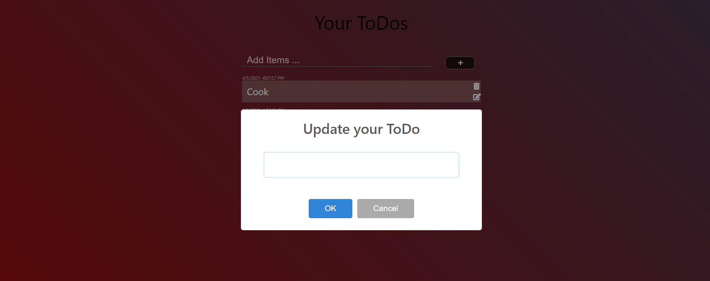

<h1> <a href="https://todoappauth-7acab.web.app/">Your Todos </a></h1>

<h1>Overview</h1>

   This full stack application mainly aims to let the users when they login with their Gmail account to add,read,update, and delete Todos tasks. Moreover, everytime a todo task is    added it gets displayed with the actual date and time it has been created.

<h1>Technologies and Tools</h1>

<ul>
  <li> <h3>React</h3> </li>
  <li> <h3>SASS</h3> </li>
  <li> <h3>Firebase </h3> </li>
  <li> <h3> Firebase Gmail auth </h3> </li>
  <li> <h3> SweetAlert library </h3> </li>
</ul>  

